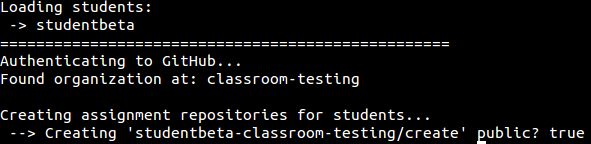

##Notacion de parametros necesaria para cada comando
Ademas de las opciones especificas de cada comando, la aplicacion necesitara de parametros de autentificacion Oauth de la API de Github, que seran cargados cada vez que se realice cualquier accion.

Estos parametros son:

`--username`

El nombre de usuario de github, si no se indica por defecto se cargara el nombre del usuario del sistema.

`--password`

La contraseña del usuario de Github, es un parametro requerido.

`--token`

El token con los permisos especificos creados para la aplicacion explicado en la [guia de instalacion](/instalacion.md).

`--api`

`--web`

###Usando variables de entorno ENV
Una buena manera de ahorrarnos tiempo y hacer menos incomodo la insercion de estos parametros cada vez que tenegamos que ejecutar una accion, es hacer uso de las variables de entorno. Guardar el token en una variable, el usuario de github y la contraseña, haran mas agil el manejo de comandos.

Una manera sencilla de añadir una variable de entorno es abrir una terminal y ejecutar:
```bash
$> vi /home/tupropiousuario/.bashrc
```
Modificando /tupropiousuario/ por tu usuario de sistema, con este comando se abrira el archivo donde se cargan las variables de entorno en el sistema (en vez de vi puedes usar el editor que mas te guste). Alli podremos asignar las variables que nos interesen.

Por ejemplo:
`TEACHERS_PET_TOKEN=4e409b9c61bf9652c32023d83af9d61af47f`

Despues de guardar el archivo hace falta volver a cargarlo para que los cambios sean efectivos.

```bash
$> source /home/tupropiousuario/.bashrc
```
Si quieres comprobar que la variable se ha guardado y cargado correctamente se puede mirar facilmente de esta forma.

```bash
echo $TEACHERS_PET_TOKEN
```

Para poder invocar a una variable de entorno hace falta usar el simbolo $, por lo que este caso en el parametro habria seria llamado tal que ``--token=$TEACHERS_PET_TOKEN ``


##Crear equipos de estudiantes

`teachers_pet create_student_teams`

Es necesario tener un archivo sin formato "students", donde los grupos esten asignados en cada linea. Por defecto se supondra el directorio raiz como la ruta asignada al archivo, pero esto podra ser modificado mediante el parametro ```--students``` donde se la podra asignar la nueva ruta al archivo y su formato. 

Si queremos un grupo individual en la linea debe estar solamente el nombre de un alumno.

Ejemplo:

>studentBeta

Si queremos un grupo en primer lugar se debera escribir el nombre del grupo, y despues asignar los usuarios.

>TeamC studentBeta studentAlpha1

Despues ejecutaremos el comando, sustituyendo las variables de entorno del ejemplo por las tuyas, o por los datos directamente.

```bash 
$> teachers_pet create_student_teams --organization=classroom-testing --username=$GITHUB_USER --password=$GITHUB_PASS --token=$TEACHERS_PET_TOKEN
```

Se crearan los equipos de trabajo, y posteriormente se añadaran los usuarios a cada grupo al que han sido asignados.


Si vamos a nuestra organizacion en Github podremos ver que efectivamente se ha creado el equipo y se a asignado a los integrantes en el.


##Añadir personas a un equipo

`teachers_pet add_to_team`

Es necesario crear un archivo, el titulo o nombre del archivo sera el equipo a manejar, y los usuarios a añadir estaran contenidos en el.

La ruta del archivo sera indicada con el parametro ```--members```.

Para nuestro ejemplo hemos creado un archivo llamado *TeamH* en el que hemos asignado escrito dentro de el al estudiante *studentbeta* 

```bash 
$> teachers_pet add_to_team --organization=classroom-testing --members=./TeamH
```
Aunque no aparezca en el ejemplo, recuerda siempre añadir al comando los parametros de autentificacion.


Vemos como el estudiante ha sido asignado al equipo.


##Creando repositorios para una tarea o asignacion
`teachers_pet create_repos`

Con este comando podremos asignar un asignacion de un repositorio a uno o varios estudiantes. Para ello debemos tener un fichero por defecto *./students* o añadir la ruta con el parametro ```--students```.

```bash 
$> teachers_pet create_repos --organization=classroom-testing --repository=classroom-testing/create --public=true
```



Podemos ver que se ha creado la asignacion al estudiante del repositorio original.


##Clonar un repositorio de una tarea
`teachers_pet clone_repos`

Si queremos clonar un repositorio en una maquina local usaremos este comando en el que le asignaremos el repositorio de la tarea de los estudiantes que nos interese.

`--repository` Cuando se asigna un repositorio a un usuario, automaticamente se toma como nombre el nombre de la organizacion mas el propio nombre del repositorio original. Por lo tanto si la organizacion de ejemplo se llama *classroom-testing* y el nombre del repositorio es *create*, el nombre del repositorio a asignar a este parametro seria *classroom-testing-create*

```bash
teachers_pet clone_repos --organization=classroom-testing --repository=classroom-testing-create

```


##Abrir un issue para todos los repositorios de la organizacion

`teachers_pet open_issue`

##Añadir colaboladores a un repositorio
`teachers_pet add_collabolators`

##Hacer un Merge de todos los Pull Requests disponibles en un repositorio
`teachers_pet merge_pull_requests`

##Ver quien ha hecho un fork de un repositorio

`teachers_pet fork`

Con este comando podras saber que alumnos han hecho un fork de un repositorio en concreto, que sea pasado como parametro. La lista de alumnos sera creada y guardada en un archivo students.csv por defecto, o indicando la ruta y el archivo donde quieras con el parametro --output.

